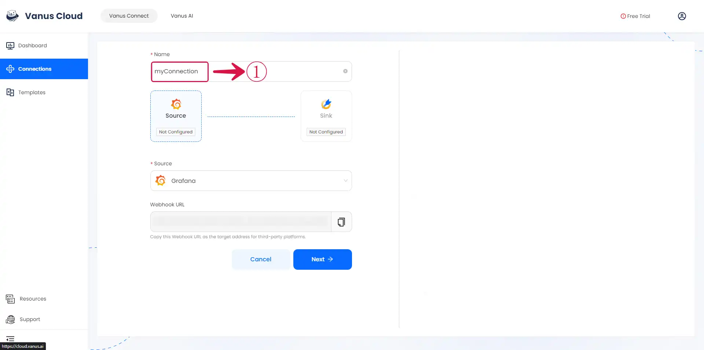
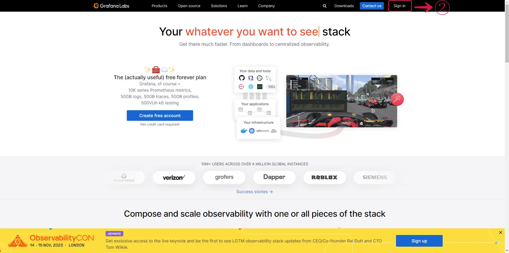
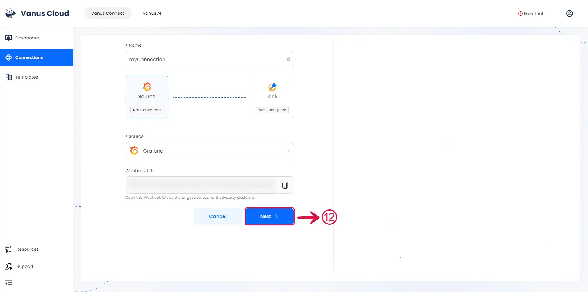

# Grafana

This guide contains information to set up a Grafana Source in Vanus Connect.

## Introduction

Grafana is an open-source platform for data visualization and analytics. It enables users to create and share dashboards, charts, and alerts across multiple data sources.

The Grafana Source is a webhook server that enables you to establish an endpoint for receiving events from Grafana. To achieve this, it is necessary to establish a connection within Grafana.

## Prerequisites

- A [**Vanus Cloud account**](https://cloud.vanus.ai)
- A Grafana instance or a [**Grafana cloud account**](https://grafana.com/)

---

## Getting Started

To obtain all Grafana events using Vanus Connect, follow these steps:

### Grafana Connection Settings

- Write a **Name**① for your connection in Vanus Connect.

# Configuring Grafana to send Events

1. Click on the **copy**① icon to copy the Webhook URL. Use the Webhook URL to receive events.

3. Log in to your [**Grafana Account**]②(https://grafana.com).

4. Click on the **hamburger button**③, navigate to **Alerts & IRM**④, and select **Alerting**⑤.

5. Select **Contact points**⑥, and click on **Add contact point**⑦.

6. **Name**⑧ your contact point, click on integration and select **webhook**⑨, provide the payload **URL**⑩ from Vanus Connect, and **Save contact point**⑪.

7. Click **Next**⑫ and continue the configuration.

---

Learn more about Vanus and Vanus Connect in our [**documentation**](https://docs.vanus.ai).
