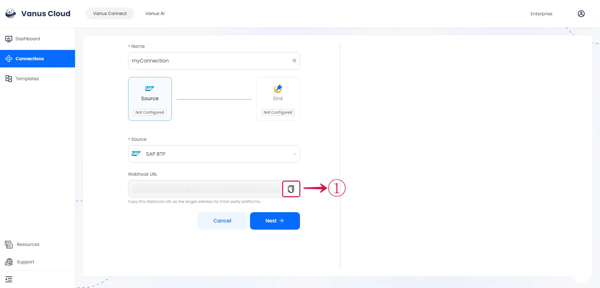
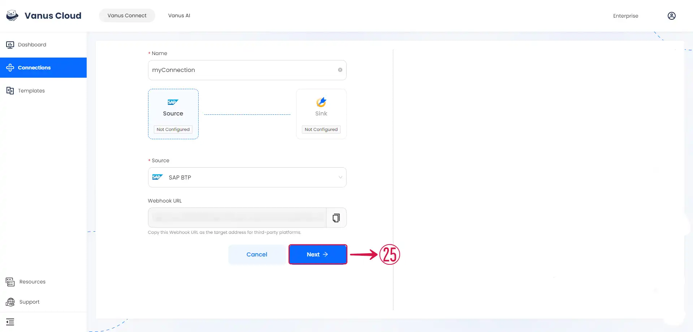

# SAP BTP

This guide contains information to set up a SAP BTP Source in Vanus Connect.

## Introduction

SAP BTP, short for SAP Business Technology Platform, is a comprehensive platform-as-a-service (PaaS) that enables organizations to build, integrate, and extend their business applications and processes in a cloud-based environment. SAP BTP offers a range of services and tools that empower businesses to develop and deploy innovative applications, connect to various data sources, and leverage advanced technologies like artificial intelligence (AI), machine learning (ML), and Internet of Things (IoT).

The SAP BTP Source is a webhook server that enables you to establish an endpoint for receiving events from your SAP BTP application. To achieve this, it is necessary to establish a connection within SAP BTP.

## Prerequisites

Before obtaining SAP BTP events, you must have:

- A SAP BTP account with administrative privileges
- A [**Vanus Cloud account**](https://cloud.vanus.ai)

## Getting Started

### Create your connection in Vanus Connect

- Write a **Name**① for your connection in Vanus Connect.

### Configure SAP BTP to Send Webhook Events

#### Step 1: Configure webhook

1. Click the **copy**① icon to copy the webhook url.

2. Log in to your [**SAP BTP account**](https://accounts.sap.com/).

3. Navigate to the **Subaccounts**② page by clicking on it.

4. Click on **Services**③ and select **Instances and Subscriptions**④.

5. Click on the **Create**⑤ button at the top right.

6. Click on **Select Service**⑥ to reveal the dropdown menu.

7. Select **Alert Notification**⑦, choose an **Instance Name**⑧ of your choice and click on **Next**⑨.

8. Leave the Instance parameters as default and click **Next**⑩.

9. Click **Create**⑪.

10. Click on the **name of the Instance**⑫ that was just created.

11. Click on **Actions**⑬.

12. Click on **Create**⑭.

13. Scroll down and select **Webhook**⑮ as the action type and click on **Next**⑯.

:::note
Do not select the **Webhook with Authorization Token** or **Webhook with Basic Authentication** as they would need extra level of authentication.
:::

14. Insert a desired **Name**⑰ for your webhook and **Description**⑱ or **Labels**⑲ if any.

15. Scroll down, paste the webhook URL you copied earlier in the **URL Address**⑳ section, tick the **Accept any SSL certificate**㉑ checkbox and click **Create**㉒.

16. Click on **Close**㉓.

17. A successful webhook integration would look like **this**㉔.

18. Click **Next**㉕ and continue the configuration.

---

Learn more about Vanus and Vanus Connect in our [**documentation**](https://docs.vanus.ai).
