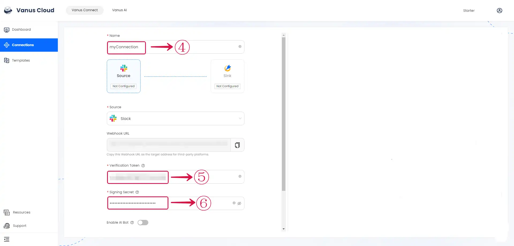
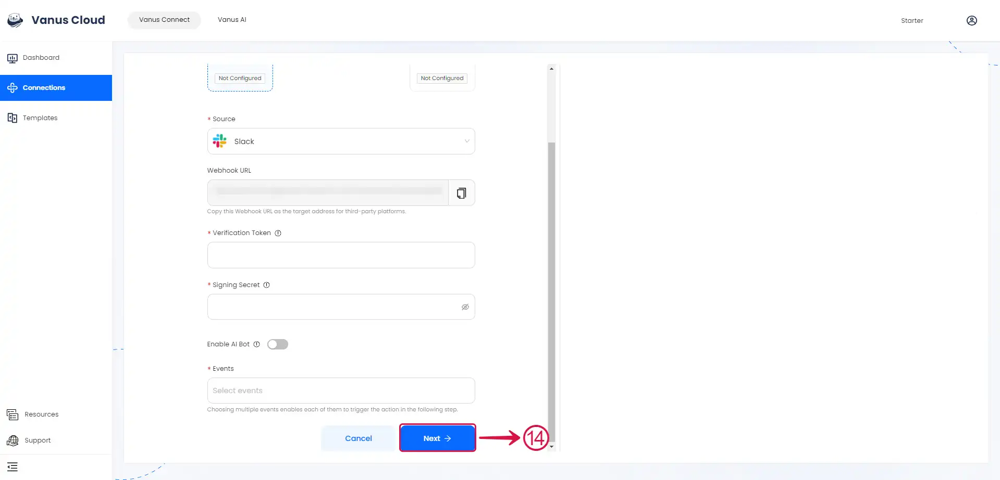

# Slack

This guide contains information to set up a Slack Source in Vanus Connect.

## Introduction

Slack is a cloud-based team collaboration platform that allows users to communicate, share files, and integrate with other tools and services.

Our Slack Source connector, lets you receive events when users join, message, react etc.

## Prerequisites

Before obtaining Slack events, you must have:
- Have a [Slack account](https://slack.com).
- A [Vanus Cloud account](https://cloud.vanus.ai).

## Getting Started

### Step 1: Create an app in Slack

1. Go to [Slack API](https://api.slack.com/apps), and click **Create New App**①.

 

2. Select **From Scratch**②.

 

3. Set the **App Name**③, **Workspace**④, and click the **Create App**⑤ button.

 

### Step 2: Get App Credentials

1. Go to **Basic Information**①.

 

2. Scroll down to **App Credentials** and copy the **Verification Token**②, and **Signing Secret**③.

 

3. Go to your Vanus Connection, Give the connection a **Name**④, paste the **Verification Token**⑤ and **Signing Secret**⑥ from Slack as configurations.

 

---

### Step 3: Configure Event Subscription

1. Click the **copy icon**① to copy the webhook URL, select the **Events**② you want to receive. 

 

2. Go back to your Slack App, and click on **Event Subscriptions**③ in the side menu.

3. **Enable Events**④ by turning on the switch, and use the URL we've previously copied and paste it into **Request URL**⑤. You should see a green `Verified`, indicating our Source is verified by Slack.

4. Scroll down, click **Subscribe to bot events**⑥ and after, you will be able to click **Add Bot User Event**⑦.

5. Select the event **message.channels**⑧.

6. Click on **Save Changes**⑨ to complete your configuration.

7. Go to **Install App**⑩ from the side menu and click **Install to Workspace**⑪.

8. Click on **Allow**⑫.

9. Go to your Slack workspace, invite the bot to the channel by clicking **Add to Channel**⑬ button.

10. Click **Next**⑭ to continue the configuration.

 

---

Learn more about Vanus and Vanus Connect in our [**documentation**](https://docs.vanus.ai).
